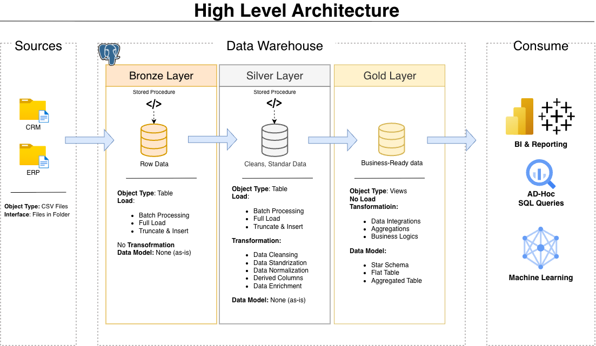

# Data Warehouse and Analytics Project

Welcome to the **Data Warehouse and Analytics Project** repository 🚀  

This project demonstrates a complete end-to-end **Modern Data Warehouse implementation**, from raw data ingestion to analytical reporting. It is designed as a portfolio-grade project showcasing industry best practices in:

- Data Engineering  
- Data Modeling  
- ETL Development  
- Data Quality Validation  
- SQL-based Analytics  

---

# 🏗️ Data Architecture

This project follows the **Medallion Architecture** pattern consisting of:

- **Bronze Layer** – Raw data ingestion  
- **Silver Layer** – Data cleansing and transformation  
- **Gold Layer** – Business-ready dimensional modeling  

## 🔹 Bronze Layer
- Stores raw data exactly as received from source systems.
- Data is ingested from **CSV files (ERP & CRM)** into **PostgreSQL**.
- No transformation is applied at this stage.
- Acts as a single source of truth for raw data.

## 🔹 Silver Layer
- Performs data cleansing, validation, and standardization.
- Handles null checks, duplicates, invalid formats, and data consistency.
- Prepares structured datasets for analytical modeling.

## 🔹 Gold Layer
- Implements a **Star Schema** (Fact & Dimension tables).
- Optimized for reporting and analytical workloads.
- Enforces surrogate key uniqueness and referential integrity.

---

# 📖 Project Overview

This project includes:

## 1️⃣ Data Architecture
Designing a scalable and modular warehouse using Medallion Architecture.

## 2️⃣ ETL Pipelines
Building SQL-based pipelines to:
- Extract data from ERP & CRM systems  
- Clean and standardize records  
- Load curated datasets into structured models  

## 3️⃣ Data Modeling
Developing:
- Fact tables (sales transactions)
- Dimension tables (customers, products)
- Surrogate keys
- Referential integrity validation

## 4️⃣ Analytics & Reporting
Creating SQL-based analytical queries for:
- Customer behavior analysis  
- Product performance insights  
- Sales trend monitoring  

---

# 🎯 Who Is This Project For?

This repository is ideal for:

- Data Engineers  
- Data Analysts  
- SQL Developers  
- Data Architects  
- ETL Pipeline Developer
- Data Modeling
---

# 🛠️ Tools & Technologies

All tools used in this project are free and open-source.

- **PostgreSQL** – Relational database system  
  🔗 Download: https://www.postgresql.org/download/

- **pgAdmin 4** – Database GUI for managing PostgreSQL  
  🔗 Download: https://www.pgadmin.org/download/

- **Draw.io (Diagrams.net)** – Data modeling & architecture diagrams  
  🔗 Website: https://www.diagrams.net/

- **GitHub** – Version control and collaboration  
  🔗 Website: https://github.com/

- **CSV Datasets** – ERP & CRM data sources  
  📂 Located in the '[Datasets](datasets/)' folder of this repository

---

# 🚀 Project Requirements

## 🏗️ Building the Data Warehouse (Data Engineering)

### Objective
Develop a modern PostgreSQL-based data warehouse to consolidate sales data and enable analytical reporting.

### Specifications
- Import ERP and CRM datasets from CSV files  
- Perform data cleansing and quality validation  
- Integrate datasets into a unified analytical model  
- Focus on the latest dataset (no historization required)  
- Provide complete documentation of the data model  

---

## 📊 BI: Analytics & Reporting

### Objective
Generate SQL-based insights covering:

- Customer behavior  
- Product performance  
- Sales trends  

These insights empower stakeholders to make data-driven strategic decisions.

---

# 📂 Repository Structure
data-warehouse-project/
│
├── datasets/                           # Raw datasets used for the project (ERP and CRM data)
│
├── docs/                               # Project documentation and architecture details
│   ├── data_architecture.png        # Png file shows the project's architecture
│   ├── data_catalog.md                 # Catalog of datasets, including field descriptions and metadata
│   ├── data_flow.png                # Png file for the data flow diagram
├── data_integration.png                # Png file for the data integration
│   ├── data_models.png              # Png file for data models (star schema)
│   ├── naming-conventions.md           # Consistent naming guidelines for tables, columns, and files
│
├── scripts/                            # SQL scripts for ETL and transformations
│   ├── bronze/                         # Scripts for extracting and loading raw data
│   ├── silver/                         # Scripts for cleaning and transforming data
│   ├── gold/                           # Scripts for creating analytical models
│
├── tests/                              # Test scripts and quality files
│
├── README.md                           # Project overview and instructions
└── LICENSE                             # License information for the repository
---

# 🧪 Data Quality & Validation

This project includes structured quality checks for:

- Duplicate primary keys  
- Null validations  
- Invalid date formats  
- Negative or inconsistent values  
- Referential integrity between fact and dimension tables  

All quality checks are implemented using PostgreSQL-compatible SQL scripts.

---

# ☕ Stay Connected

Let’s connect and collaborate:

---

# 🛡️ License

This project is licensed under the **MIT License**.  
You are free to use, modify, and distribute this project with proper attribution.

---

# 🌟 About Me

Hi, I'm **Arief Dwi Rachmadian** 👋  

I am a **Data Engineer** with hands-on experience building scalable data pipelines and modern data warehouse solutions using:

- PostgreSQL  
- Python  
- AWS (S3, ECS, ECR, Lambda)  
- Docker  
- SQL-based ETL pipelines  

Let’s build reliable data systems together 🚀
